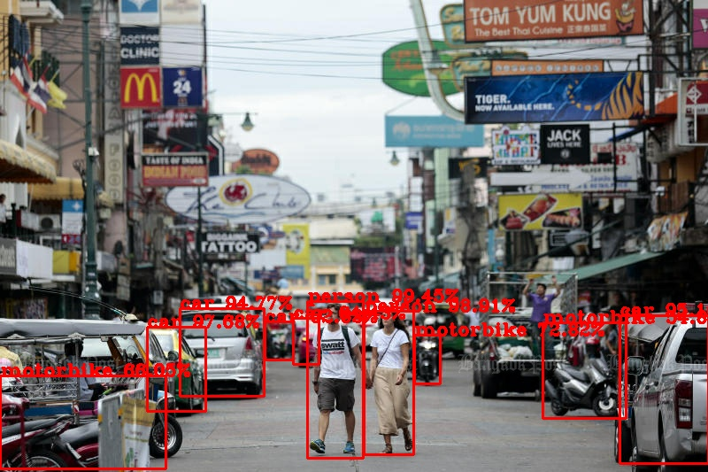

# YOLOv3 implementation in Tensorflow 2
An elegant Yolov3 implementation in Tensorflow 2.0.


## Installation
Clone the repo to your local
```
git clone https://github.com/Dawittsegaye12/Custom-Object-Detection.git
```
Install the requirements
```
pip install -r requirements.txt
```
Download yolov3 darknet weights and convert to tensorflow format
```
wget https://pjreddie.com/media/files/yolov3.weights -O data/yolov3.weights
python convert.py --weights ./yolov3.weights --output ./checkpoints/yolov3.tf
```
## Usage
This is the time to enjoy. Let's detect some images!
```
python test.py --image_path /path/to/image --model_path ./checkpoints/yolov3.tf
```

## Training
I also provide a pipeline for training the model on COCO 2017 dataset.
Download COCO 2017 dataset, extract and put them into `data/raw` directory.
```
wget http://images.cocodataset.org/zips/train2017.zip
wget http://images.cocodataset.org/zips/val2017.zip
wget http://images.cocodataset.org/annotations/annotations_trainval2017.zip
```
Create tfrecord files for training pipeline
```
python tools/create_tfrecords.py --data_dir ../data/raw --split train --output_file coco2017_train.tfrecord
python tools/create_tfrecords.py --data_dir ../data/raw --split val --output_file coco2017_val.tfrecord
```
The 2 tfrecord files should be generated in `data/processed` directory.
If everything is done, let's train the model
```
python train.py \
	--train_file ./data/processed/coco2017_train.tfrecord \
	--val_file ./data/processed/coco2017_val.tfrecord \
	--batch_size 8 \
	--epochs 20 \
	--lr 0.001
```


